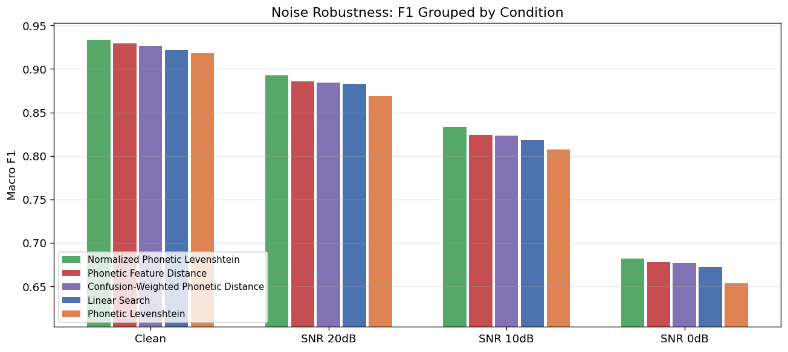
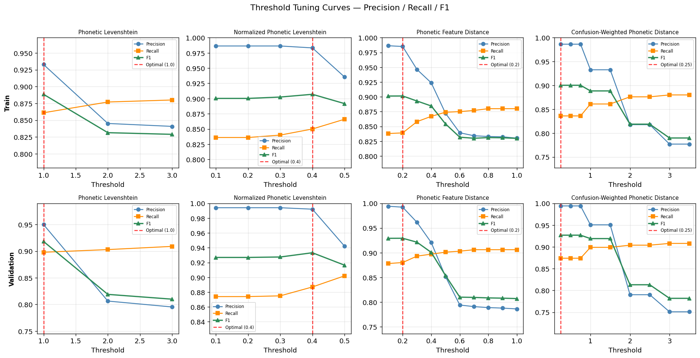

# Post-Hoc Keyword Detection over Whisper ASR

This repository holds the source code for a research report that compares five different phonetic keyword detection methods applied post-hoc to Whisper ASR transcriptions. To achieve keyword detection without
requiring the resource-intensive training of specialized KWS models, this study proposes and
evaluates five post-hoc phonetic matching frameworks applied directly to Whisper's text output.
By converting transcriptions into ARPAbet phoneme sequences, the frameworks apply distance
metrics of varying complexity: linear search, Levenshtein distance, Euclidean phonetic space
distance, and confusion-weighted metric.

## Video Overview

https://youtu.be/Wt2knAQcHFQ

## Project Objective

Standard keyword spotting (KWS) systems operate directly on raw audio with task-specific models. This project investigates whether phonetic detectors on top of a general-purpose ASR model (Whisper) can achieve competitive performance.

The five detectors, in order of complexity:

| Detector | Method |
|---|---|
| **Linear Search** | At the most basic level, linear search serves as our control. It will perform an exact word match between the transcription and the target keyword list. If a match occurs, a detection is recorded. This method serves to analyze the base rate of the Whisper model. |
| **Phonetic Levenshtein** | Each transcribed word is converted into its ARPAbet phoneme sequence utilizing the CMU Pronouncing Dictionary. We then calculate the Levenshtein edit distance between the phoneme sequence of the transcribed word and the keyword. A match is registered if the distance is less than or equal to an integer threshold, k. k = 0: Requires an identical phoneme sequence. k = 1: Permits a single phoneme insertion, deletion, or substitution. k ≥ 2: Higher thresholds allows more capacity to more detect more words but comes at a cost of higher false-positive rates. |
| **Normalized Phonetic Levenshtein** | A significant flaw with counting integer Levenstein distance is its failure to differentiate short keywords. For example, even at threshold k = 2, a keyword like "beam" which is composed of 3 phonemes will match to almost anything. To mitigate these false positives, we implemented a normalized edit distance metric. The integer distance is divided by the total number of phonemes in the target keyword, and evaluated against a fractional threshold, r. For example, r = 0.33 would translate to at most one-third of the keyword's phoneme may differ. This normalization makes the threshold length-invariant.|
| **Phonetic Feature Distance** | The previous approaches treat all phonetic substitutions as equal cost, which does not reflect real world differences between phonetic similarities. To address this, we implement the phonetic distance metric from Microsoft's PhoneticMatching library. Each ARPAbet phoneme is mapped to a three-dimensional articulatory feature vector. Consonants are encoded as (phonation, place of articulation, manner of articulation). Vowels are instead encoded as (0.1, backness, height). The substitution cost between two phonemes is then the Euclidean distance between their vectors. Insertion and deletion costs are phonetic-dependent: vowels carry a cost of 0.5 while consonants carry 0.25, as omitting a vowel is more significant than omitting a consonant. |
| **Confusion-Weighted Phonetic Distance** | The Microsoft metric encodes hand-crafted articulatory theory. While this may be perfect for real world similarities, it does not reflect how Whisper specifically fails. Our final detector replaces fixed substitution costs with a derived phoneme confusion matrix built from Whisper's transcription errors on the Google Speech Commands (GSC) training set. For each training clip, Whisper's transcription is aligned against the ground-truth phoneme sequence, and every (reference, hypothesis) phoneme pair is recorded. The substitution cost between phonemes p and q is defined as 1 − P(q | p), where P(q | p) is the probability that Whisper transcribes phoneme p as q. Under this method, a commonly confused pair costs nearly zero, and a never-observed substitution costs 1.0. Insertion and deletion costs remain uniform at 1.0. This yields a detector uniquely calibrated to Whisper's own error distribution rather than idealized theory. |

## Pipeline

The Google Speech Command (GSC) dataset is used for training, tuning and valdation purposes. First, the confusion matrix is generated for confusion-weighted detector. This is done by utlizing the GSC dataset to analyze which phonetics Whisper frequently confused with each other. Then, all of the training split GSC data is transcribed. Ultizing the transcription, a optimal F1 threshold is calculated for each detector.

Finally, to benchmark each approach, The validation split was then transcribed under four conditions: clean audio and Gaussian white noise at signal-to-noise ratio (SNR) 20, 10, and 0 dB. For each condition and detector, per-keyword precision, recall, and F1 were recorded, along with macro-averaged scores.

## Results

### Macro-averaged scores for each detector's performance on the GSC validation dataset:
| Detector | Precision | Recall | F1 |
| :--- | :---: | :---: | :---: |
| NormPhonetic(r=0.4) | 0.992 | 0.887 | 0.933 |
| MSPhonetic(k=0.2) | 0.992 | 0.880 | 0.929 |
| ConfusionWeighted(k=0.25) | 0.994 | 0.874 | 0.927 |
| LinearSearch | 0.994 | 0.866 | 0.922 |
| Phonetic(k=1) | 0.950 | 0.898 | 0.918 |

### Macro-averaged F1 scores by noise level for each detector on the GSC validation dataset


### Precision, recall, and F1 of thresholder detectors over training and validation splits.


## Key Findings

- The Normalized Phonetic Levenshtein distance proved to be the most optimal detector across all noise levels. This is because it's performence in both substitution and phonetic deletion errors.
- Complex phonetic and Confusion-Weighted detectors underperformed and the tuning step effectively collapsing to the baseline of a simple Linear Search—because they penalized deletion errors too heavily and failed to account for Whisper's tendency to drop phonemes.
- The simple, discrete Phonetic Levenshtein distance yielded the worst overall performance (F1 = 0.918) due to a high false-positive rate.
- Continuous-valued detectors offer much finer control over the precision/recall tradeoff, allowing for users to tune thresholds based on specific deployment needs.

This report and data suggest that applying static detector over ASR models may lead to a slight improvement in F1 scores in the KWS problem area. This report suggests that any detectors created must align with the way that the ASR model makes errors to be successful. One area to explore further is how these detectors operate with data that incorporates keywords within normal speech. These detectors, due to their nature, may produce many false positives when not interacting with pure keyword data. It may be for these detectors to be helpful acoustically unique keywords need to be choosen.

---

## Repository Structure

```
posthoc-keyword-dectection/
├── classes/
│   ├── stt.py                  # WhisperModel wrapper (openai/whisper-base)
│   ├── detector.py             # All five detector implementations
│   ├── phonetic.py             # ARPAbet phoneme lookup + alignment utilities
│   └── ms_phonetic/
│       ├── vectors.py          # Articulatory feature vectors (PatPho scheme)
│       └── distance.py         # MS PhoneticMatching edit distance
├── grader/
│   ├── build_confusion.py      # Build Whisper phoneme confusion matrix from train split
│   ├── transcribe.py           # Cache Whisper transcriptions (with optional noise)
│   ├── tune.py                 # Sweep and select thresholds on train split
│   ├── evaluate.py             # Run all detectors, compute P/R/F1
│   ├── results_viz.ipynb       # Visualisation
│   └── data/                   # Generated data files
│       ├── phoneme_confusion.json
│       ├── transcriptions_train.jsonl
│       ├── transcriptions_validation.jsonl
│       ├── transcriptions_validation_snr{0,10,20}.jsonl
│       ├── thresholds.json
│       ├── threshold_curves.json
│       ├── threshold_curves_validation.json
│       └── results{,_snr0,_snr10,_snr20}.json
├── config.py                   # Global constants
├── run_all.sh                  # Full pipeline script
└── pyproject.toml
```

---

## Setup

Requires Python 3.13+ and the uv package manager.

```bash
uv sync
```

---

## Running the Full Pipeline

```bash
bash run_all.sh
```

This executes all steps in order:

1. Transcribe the train split from the GSC dataset
2. Tune thresholds via macro F1 sweep on train transcriptions
3. Transcribe the validation split under 4 conditions (clean, SNR 20/10/0 dB)
4. Evaluate all detectors

## Running Steps Individually

### 1. Build phoneme confusion matrix

```bash
uv run python -m grader.build_confusion --samples 100
```

### 2. Transcribe audio clips

```bash
# Train split (used for threshold tuning)
uv run python -m grader.transcribe --split train --samples 50 --unknown 600

# Validation split — clean and noisy conditions
uv run python -m grader.transcribe --split validation --samples 50 --unknown 600
uv run python -m grader.transcribe --split validation --samples 50 --unknown 600 --snr 20
uv run python -m grader.transcribe --split validation --samples 50 --unknown 600 --snr 10
uv run python -m grader.transcribe --split validation --samples 50 --unknown 600 --snr 0
```

### 3. Tune thresholds

```bash
# Tune on train split
uv run python -m grader.tune

# Tune on validation only for comparison plots
uv run python -m grader.tune \
  --transcriptions grader/data/transcriptions_validation.jsonl \
  --curves-out grader/data/threshold_curves_validation.json \
  --no-save-thresholds
```

### 4. Evaluate

```bash
uv run python -m grader.evaluate
uv run python -m grader.evaluate \
  --transcriptions grader/data/transcriptions_validation_snr20.jsonl \
  --results        grader/data/results_snr20.json
uv run python -m grader.evaluate \
  --transcriptions grader/data/transcriptions_validation_snr10.jsonl \
  --results        grader/data/results_snr10.json
uv run python -m grader.evaluate \
  --transcriptions grader/data/transcriptions_validation_snr0.jsonl \
  --results        grader/data/results_snr0.json
```

### 5. Visualise results

The `grader/results_viz.ipynb` file generate four plots:

1. **Macro P/R/F1**: all detectors on clean audio
2. **Noise robustness**: macro F1 grouped by condition, sorted within each group
3. **Top 3 / Bottom 3 keywords**: per-keyword F1 on clean audio
4. **Threshold tuning curves**: P/R/F1 vs threshold for each tunable detector (train and validation rows)


## Dataset

[Google Speech Commands v0.01](https://huggingface.co/datasets/google/speech_commands) via HuggingFace `datasets`.

- 20 target keywords:** yes, no, up, down, left, right, on, off, stop, go, zero, one, two, three, four, five, six, seven, eight, nine
- **10 hard negatives:** bed, bird, cat, dog, happy, house, marvin, sheila, tree, wow
- 50 clips per keyword + 600 negative clips per evaluation condition

---

## ASR Model

`openai/whisper-base` via HuggingFace `transformers`, forced to English (`language="en"`, `task="transcribe"`). The confidence threshold is disabled (`log_prob_threshold=-inf`) so all clips produce a transcription regardless of model confidence, avoiding selection bias under noisy conditions.
